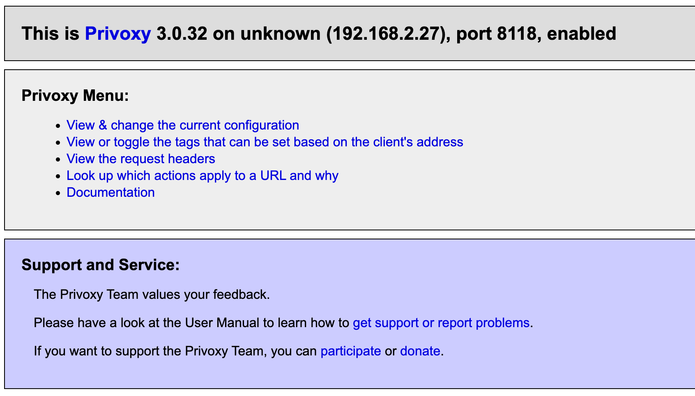

# Proxy Services

### Objectives

In this lab you:

- set up your Pi as a Proxy server.
- configure the Proxy server.
- set your laptop browser to use the Proxy server.

This lab is adapted from `https://pimylifeup.com/raspberry-pi-proxy-using-privoxy/`

**1.** Before we install the Privoxy software to our Raspberry Pi, we need to update the  existing packages.

We can do this by running the following two commands on the Pi’s terminal.

```
sudo apt update
sudo apt upgrade
```

**2.** Now we can install Privoxy by running the following command.

Installing Privoxy is simple as it is available from the Raspbian package repository.

```
sudo apt install privoxy
```

### Allow Other Local devices to Connect to the Proxy

Now that we have installed the Privoxy software, we can now go ahead and make some changes to its configuration to allow outside access to the proxy server.

By default, Privoxy is set up so only the local computer can access its proxy server.

**1.** To be able to configure the Privoxy software to allow outside connections we will have to modify its config file.

Begin modifying this file by running the following command.

```
sudo nano /etc/privoxy/config
```

**2.** In this file, search for the following block of text.

This text is what defines what addresses Privoxy will listen on. At the moment it is set to only listen on the loopback device.

By changing this to our replacement, we will be allowing any outside device to connect through the proxy.

**Find**

```
listen-address  127.0.0.1:8118
listen-address  [::1]:8118
```

**Replace With**

```
listen-address 192.168.4.21:8118
```

Replace 192.168.4.21 with the IP address of your Pi. Once done, save the file by pressing CTRL + X, followed by Y, then ENTER.

**4.** For our new changes to be loaded in, we need to restart the Privoxy service.

We can restart the service by running the following command.

```
sudo service privoxy restart
```

### Verifying your Raspberry Pi Proxy Server is Working

Before beginning this section, we highly recommend that you make sure your Raspberry Pi has a [static local IP address](https://pimylifeup.com/raspberry-pi-static-ip-address/).

**1.** To be able to make use of Privoxy you will need to change your [web browser](https://pimylifeup.com/category/guides/browsers/) to make use of your Raspberry Pi’s proxy server.

The method for this differs browser to browser.

- **On a Mac**
  1. Open the network applet, click on the lock to make changes.
  2. Click on the `Advanced...` button of your active internet connection
  3. Click on the `Proxies` Tab.
  4. Check the `Web Proxy (HTTP)` box in the list and add the IP of your raspberry Pi and port 8118.
  5. Click `Ok` then `Apply`
- **On a Windows machine**
  1. Search for `Change Proxy Settings` in the Windows search bar.
  2. In the `Manual proxy setup` section, check the `Use a proxy server` box 
  3. Add the IP of your raspberry Pi and port 8118.
  4. Click `Save `

**2.** Once you have configured your proxy settings to point to your Raspberry Pi, go ahead and go to the following address.

```
http://config.privoxy.org/
```

**3.** If you are greeted by a message saying “**Privoxy is not being used**“, you will need to double-check that your proxy settings are correct. Also, close all your browsers pages, clear your browser Cache (at least for the last hour) and then restart your browser.

If everything is working, you are greeted by the screen below. **Take a screenshot of the page ProxyRunning.jpg**.



**4.** Open any web site. Then on the Pi, issue the command `netstat -at`from a terminal window. You should see the connection of your laptop to the Pi Proxy port. **Make a screenshot of that screen netstat.jpg**.

### Submitting your Lab

Upload the screenshots to Brightspace.
