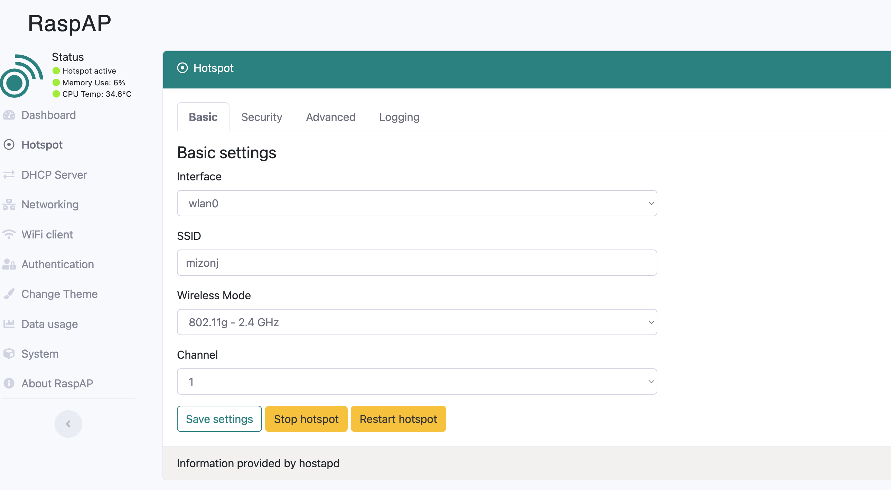
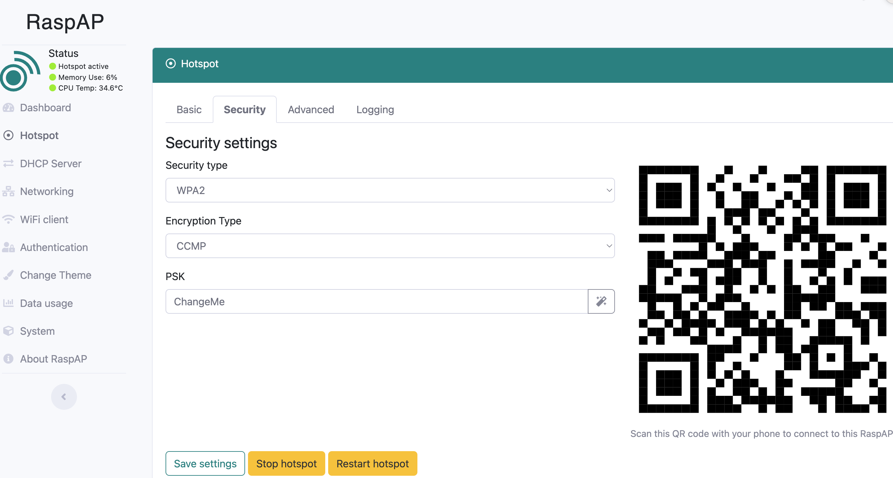
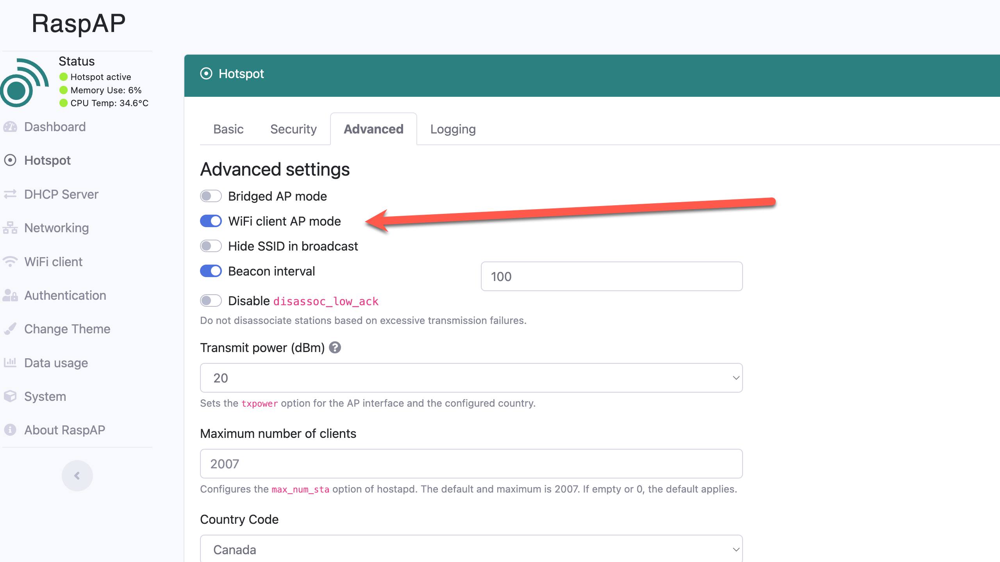

# Access Point

### Objectives

In this lab you:

- set up your Pi as a router/wireless access point.

On your `pi`, you first stop all unneeded services. Use `netstat -at` to see the list of opened TCP ports on your pi.

To stop a service like `Apache2`

`sudo service apache2 stop`

### Installing RaspAP

**1.** Before we install the Raspap software to our Raspberry Pi, we need to update the  existing packages.

We can do this by running the following two commands on the Pi’s terminal.

```
sudo apt update
sudo apt upgrade
```

**2.** Now we can install RaspAP by running the following command.

```
pi@raspberrypi:~ $ curl -sL https://install.raspap.com | bash


 888888ba                              .d888888   888888ba
 88     8b                            d8     88   88     8b
a88aaaa8P' .d8888b. .d8888b. 88d888b. 88aaaaa88a a88aaaa8P
 88    8b. 88    88 Y8ooooo. 88    88 88     88   88
 88     88 88.  .88       88 88.  .88 88     88   88
 dP     dP  88888P8  88888P  88Y888P  88     88   dP
                             88
                             dP      version 2.8.7

The Quick Installer will guide you through a few easy steps


RaspAP Install: Configure installation
Detected OS: Raspbian GNU/Linux 11 (bullseye)
Using GitHub repository: RaspAP/raspap-webgui 2.8.7 branch
Configuration directory: /etc/raspap
lighttpd root: /var/www/html? [Y/n]: Y
Installing lighttpd directory: /var/www/html
Complete installation with these values? [Y/n]: Y
RaspAP Install: Updating sources
Hit:1 http://archive.raspberrypi.org/debian bullseye InRelease
Hit:2 http://raspbian.raspberrypi.org/raspbian bullseye InRelease
Reading package lists...
RaspAP Install: Checking for systemd network services
systemd-networkd.service is not running (ok)
systemd-resolved.service is not running (ok)
[ ✓ ok ] 
RaspAP Install: Installing required packages
```

...

**The arrow <========================== indicates where you need to interact with the installation and specifies the answer you need to provide.**

```
RaspAP Install: Optimize PHP configuration
Enable HttpOnly for session cookies (Recommended)? [Y/n]: Y   <==========================
Php-cgi enabling session.cookie_httponly.
RaspAP Install: Cloning latest files from github
Cloning into '/tmp/raspap-webgui'...
[ ✓ ok ] 
RaspAP Install: Changing file ownership in web root directory
RaspAP Install: Creating hostapd logging & control scripts
[ ✓ ok ] 
RaspAP Install: Creating lighttpd control scripts
Copying configport.sh to /etc/raspap/lighttpd
Changing file ownership
[ ✓ ok ] 
RaspAP Install: Copying lighttpd extra config files
Copying 50-raspap-router.conf to /etc/lighttpd/conf-available
Creating link to /etc/lighttpd/conf-enabled
Existing 50-raspap-router.conf found. Unlinking.
unlink: cannot unlink '/etc/lighttpd/conf-enabled/50-raspap-router.conf': No such file or directory
Linking 50-raspap-router.conf to /etc/lighttpd/conf-enabled/
[ ✓ ok ] 
RaspAP Install: Moving configuration file to /etc/raspap
changed ownership of '/etc/raspap/raspap.php' from root:root to www-data:www-data
RaspAP Install: Applying default configuration to installed services
Changing file ownership of /etc/raspap/networking/defaults.json
Checking for existence of /etc/dnsmasq.d
Copying bridged AP config to /etc/systemd/network
Copying primary RaspAP config to includes/config.php
[ ✓ ok ] 
RaspAP Install: Configuring networking
Enabling IP forwarding
net.ipv4.ip_forward = 1
Restarting procps (via systemctl): procps.service.
Checking iptables rules
Adding rule: -t nat -A POSTROUTING -j MASQUERADE
Adding rule: -t nat -A POSTROUTING -s 192.168.50.0/24 ! -d 192.168.50.0/24 -j MASQUERADE
Persisting IP tables rules

Enable RaspAP control service (Recommended)? [Y/n]: Y <==========================

RaspAP Install: Enabling RaspAP daemon
Disable with: sudo systemctl disable raspapd.service
Created symlink /etc/systemd/system/multi-user.target.wants/raspapd.service → /lib/systemd/system/raspapd.service.
[ ✓ ok ] 
RaspAP Install: Configure ad blocking (Beta)

Install ad blocking and enable list management? [Y/n]: n <==========================

[ ✓ ok ] (Skipped)
RaspAP Install: Configure OpenVPN support

Install OpenVPN and enable client configuration? [Y/n]: n <==========================

[ ✓ ok ] (Skipped)
RaspAP Install: Configure WireGuard support

Install WireGuard and enable VPN tunnel configuration? [Y/n]: n <========================

[ ✓ ok ] (Skipped)
RaspAP Install: Adding raspap.sudoers to /etc/sudoers.d/090_raspap
RaspAP Install: Symlinked wpa_supplicant hooks for multiple wlan interfaces
RaspAP Install: Unmasking and enabling hostapd service
Removed /etc/systemd/system/hostapd.service.
Synchronizing state of hostapd.service with SysV service script with /lib/systemd/systemd-sysv-install.
Executing: /lib/systemd/systemd-sysv-install enable hostapd
[ ✓ ok ] 
RaspAP Install: Installation completed
Join RaspAP Insiders for early access to exclusive features!

> https://docs.raspap.com/insiders/
> https://github.com/sponsors/RaspAP/

The system needs to be rebooted as a final step. Reboot now? [Y/n]: n <=================
```

### Configuring raspAP as a hotspot

You will now access the RaspAP web interface to configure your access point. Open a browser window then connect to the web interface by typing the IP address of your Pi.

The default install use the following credentials to connect to the web interface:

Username : admin
Password : secret

In the Hotspot/Basic menu change the SSID to your username



In the Hotspot/Security menu change the PSK password from ChangeMe to a password of your choice. 



Click on Save Settings then Restart hotspot.

In the Hotspot/Advanced menu, use the slider to enable the WIFI client AP mode. Save the settings then reboot your Pi.



Once the Pi is rebooted, connect to the raspAP web interface.

Make a screenshot of:

- Hotspot/Basic screen **basic.jpg**
- Hotspot/Security screen **security.jpg**
- Hotspot/Advanced screen **advanced.jpg**
- DHCP server default screen **dhcp.jpg**

### Connecting to the hotspot

In the network/wifi settings of your phone you should see the name of the hotspot.

Select it and type the password.

Your phone is now connected to the hotspot.

### Submitting your Lab

Upload the screenshots to Brightspace.
